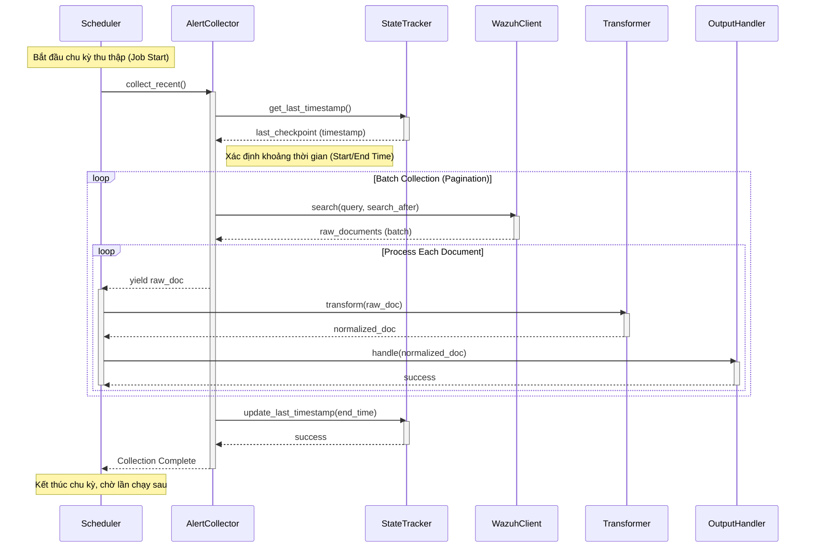

# Tài liệu Kỹ thuật: Hệ thống Thu thập Dữ liệu Wazuh (Wazuh Retrieval System)

## 1. Tổng quan Dự án (Project Overview)

Hệ thống **Wazuh Retrieval** là một module chuyên biệt được thiết kế để thu thập, chuẩn hóa và chuyển tiếp dữ liệu cảnh báo bảo mật (security alerts) từ Wazuh Indexer (nền tảng OpenSearch) đến các hệ thống phân tích hoặc lưu trữ tập trung. Hệ thống được xây dựng với khả năng vận hành bền bỉ, hỗ trợ cơ chế "backfill" (thu thập dữ liệu quá khứ) và "near-real-time" (thu thập gần thời gian thực).

### Các tính năng chính:
- **Lập lịch thông minh (Intelligent Scheduling)**: Tự động thu thập dữ liệu theo chu kỳ định sẵn.
- **Quản lý trạng thái (State Tracking)**: Ghi nhớ mốc thời gian cuối cùng đã xử lý để đảm bảo tính toàn vẹn dữ liệu, tránh trùng lặp hoặc bỏ sót khi hệ thống khởi động lại.
- **Chuẩn hóa dữ liệu (Data Normalization)**: Chuyển đổi dữ liệu thô từ Wazuh sang định dạng chuẩn (schema) thống nhất, làm phẳng các trường thông tin phức tạp như MITRE ATT&CK.
- **Cơ chế phân trang hiệu quả (Efficient Pagination)**: Sử dụng kỹ thuật `search_after` của OpenSearch để xử lý lượng dữ liệu lớn mà không gây áp lực lên bộ nhớ.

## 2. Kiến trúc và Các thành phần chính (Architecture & Components)

Hệ thống được tổ chức thành các lớp (layers) với trách nhiệm rõ ràng:

1.  **`WazuhCollectorScheduler` (Scheduler Layer)**:
    -   Đóng vai trò là "nhạc trưởng" điều phối toàn bộ quy trình.
    -   Quản lý vòng đời của job thu thập, xử lý tín hiệu dừng (graceful shutdown) và ghi nhận thống kê (statistics).

2.  **`AlertCollector` (Collection Layer)**:
    -   Chịu trách nhiệm tương tác nghiệp vụ với Wazuh.
    -   Xây dựng các truy vấn phức tạp (bool query, range filter) và quản lý logic phân trang.
    -   Tương tác với `StateTracker` để xác định phạm vi dữ liệu cần thu thập.

3.  **`WazuhIndexerClient` (Infrastructure Layer)**:
    -   Wrapper bao quanh thư viện `opensearch-py`.
    -   Quản lý kết nối HTTP/HTTPS, xác thực và xử lý lỗi kết nối ở mức thấp.

4.  **`AlertTransformer` (Transformation Layer)**:
    -   Thực hiện logic "ETL" (Extract - Transform - Load) tại chỗ.
    -   Trích xuất thông tin quan trọng từ các cấu trúc lồng nhau (nested structures) và chuẩn hóa các trường dữ liệu không đồng nhất.

5.  **`StateTracker` (Persistence Layer)**:
    -   Lưu trữ trạng thái (checkpoint) ra file JSON cục bộ.
    -   Đảm bảo khả năng phục hồi (resilience) của hệ thống sau sự cố.

## 3. Mô tả Luồng hoạt động (Detailed Control Flow)

Quy trình thu thập và xử lý dữ liệu diễn ra theo trình tự sau:

### Bước 1: Khởi tạo và Kích hoạt (Initialization)
Hệ thống bắt đầu khi `WazuhCollectorScheduler` được khởi tạo. Scheduler sẽ thiết lập kết nối đến Wazuh Indexer thông qua `WazuhIndexerClient` và tải trạng thái từ `StateTracker`. Một job định kỳ (`collect_and_process_alerts`) được đăng ký với bộ lập lịch.

### Bước 2: Xác định Phạm vi Thu thập (Scope Definition)
Khi job được kích hoạt:
1.  `AlertCollector` gọi `StateTracker` để lấy `last_timestamp` (mốc thời gian của bản ghi cuối cùng đã xử lý thành công).
2.  Nếu tìm thấy checkpoint, hệ thống sẽ thu thập dữ liệu từ mốc đó trở đi. Nếu không (lần chạy đầu tiên), hệ thống sẽ sử dụng khoảng thời gian `lookback_minutes` từ cấu hình mặc định.

### Bước 3: Truy vấn và Phân trang (Query & Pagination)
`AlertCollector` thực hiện vòng lặp thu thập dữ liệu:
1.  Xây dựng truy vấn OpenSearch DSL với bộ lọc thời gian và mức độ cảnh báo (`min_level`).
2.  Gửi truy vấn thông qua `WazuhIndexerClient`.
3.  Sử dụng cơ chế `search_after` để lấy dữ liệu theo từng trang (batch), đảm bảo hiệu năng khi làm việc với hàng triệu bản ghi.

### Bước 4: Xử lý và Chuẩn hóa (Processing & Normalization)
Với mỗi lô dữ liệu (batch) nhận được:
1.  `AlertCollector` trả về (yield) từng tài liệu thô (raw document) cho Scheduler.
2.  Scheduler chuyển tài liệu thô sang `AlertTransformer`.
3.  Transformer thực hiện làm sạch dữ liệu, trích xuất các trường thông tin quan trọng (như MITRE ID, File Hash, User info) và trả về một dictionary đã chuẩn hóa.

### Bước 5: Đầu ra và Cập nhật Trạng thái (Output & State Update)
1.  Dữ liệu chuẩn hóa được chuyển đến `OutputHandler` (ví dụ: ghi file, đẩy vào Kafka hoặc Database).
2.  Sau khi toàn bộ lô dữ liệu trong khoảng thời gian hiện tại được xử lý thành công, `AlertCollector` gọi `StateTracker` để cập nhật `last_timestamp` mới.
3.  `StateTracker` ghi đè trạng thái xuống đĩa cứng, đánh dấu điểm kiểm soát an toàn cho lần chạy tiếp theo.

## 4. Biểu đồ Tuần tự (Sequence Diagram)

Dưới đây là biểu đồ thể hiện tương tác giữa các thành phần trong một chu kỳ thu thập dữ liệu:

